```{r setup, echo=FALSE, error=FALSE, message=FALSE}
library(dplyr)
library(glue)
library(kableExtra)
library(lubridate)
library(knitr)
library(htmltools)
library(leaflet)
library(naniar)

setwd("C:/Users/inesi/OneDrive - UAM (1)/Producto_BirdNET/noctua-mas-gh/informe_md")
# setwd("C:/noctua-mas/informe_md") # para trabajar desde otro ordenador 
puntos <- read.csv("noctua.csv",sep=";",header=TRUE, stringsAsFactors = FALSE)
puntos <- puntos %>%
  mutate(
    FechaInicioGrabacionMuestreo = as.Date(FechaInicioGrabacionMuestreo),
    FechaInicioGrabacionMuestreo = format(FechaInicioGrabacionMuestreo, "%d/%m/%Y"),
    FechaFinGrabacionMuestreo = as.Date(FechaFinGrabacionMuestreo),
    FechaFinGrabacionMuestreo = format(FechaFinGrabacionMuestreo, "%d/%m/%Y"),
    FechaInstalacion = as.Date(FechaInstalacion),
    FechaInstalacion = format(FechaInstalacion, "%d/%m/%Y"),
    FechaRetirada = as.Date(FechaRetirada),
    FechaRetirada = format(FechaRetirada, "%d/%m/%Y")) %>%
  replace_with_na_at(.vars = c('HabitatDetalle','HabitatMatorral'), condition = ~.x == -99)
# graficos <- read.csv("tu_otro_archivo.csv", sep=";", stringsAsFactors = FALSE)
```

::: {style="display: flex; align-items: center; justify-content:space-between; margin-top: 30px;"}
```{=html}
<div style=display:flex; align-items:center;">
  
  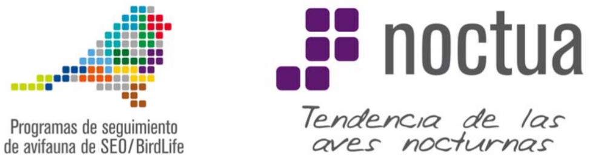
</div>
```


:::

 

<center>

<h1>**Informe de resultados NOCTUA+ 2025**</h1>

</center>

 

## **Información sobre el punto**

```{r crear_tabla_punto, echo=FALSE, message=FALSE, error=FALSE, results=FALSE}
# 1. Crear dataframe vacío
info_punto <- data.frame(
  punto = character(),
  voluntario = character(),
  temporada = character(),
  localizacion = character(),
  habitat = character(),
  stringsAsFactors = FALSE)

# 2. Crear html de la info del hábitat

#función para limpiar NAs
clean_na <- function(x) {ifelse(is.na(x) | x == "NA", "  ", x)} 

#función para poner emoji delante del tipo general de hábitat
icono_habitat <- function(x) {
  if (is.na(x) || x == "NA") return("")
  switch(x,
    "A" = "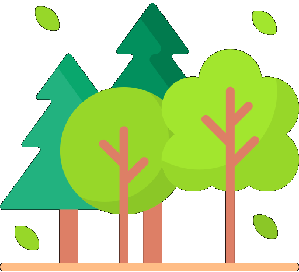",
    "B" = "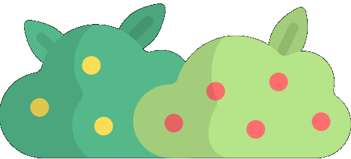",
    "C" = "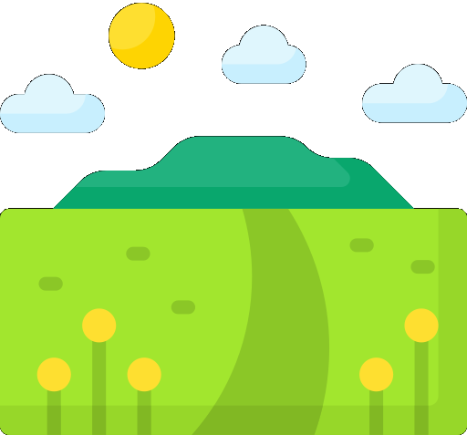",
    "D" = "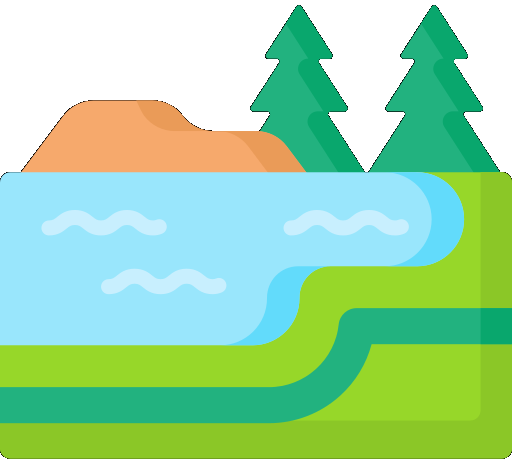",
    "E" = "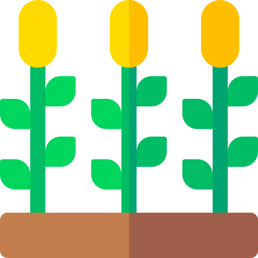",
    "F" = "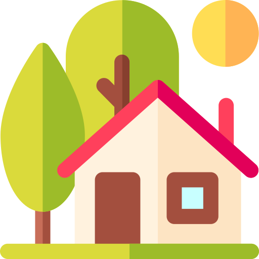",
    "")
}

habitat_html <- glue("
<table style='width:100%; border-collapse: collapse; table-layout: fixed;'>
  <tr style='text-align:center;'>
    <td style='border:1px solid #D9D9D9; padding:4px;'>{icono_habitat(params$puntos$HabitatGeneral)} {clean_na(params$puntos$HabitatGeneral)}</td>
    <td style='border:1px solid #D9D9D9; padding:4px;'>{clean_na(params$puntos$HabitatTipo)}</td>
    <td style='border:1px solid #D9D9D9; padding:4px;'>{clean_na(params$puntos$HabitatDetalle)}</td>
    <td style='border:1px solid #D9D9D9; padding:4px;'>{clean_na(params$puntos$HabitatMatorral)}</td>
  </tr>
</table>")


# 2. Añadir contenido a los campos
info_punto <- info_punto %>%
  add_row(
    punto = params$puntos$PuntoMuestreo,
    voluntario = params$puntos$Responsable,
    temporada = substr(params$puntos$FechaInicioGrabacionMuestreo, 7, 10),
    localizacion = glue("{params$puntos$Provincia} ({round(params$puntos$Latitud,5)}, {round(params$puntos$Longitud,5)})"),
    habitat = habitat_html)

# 3. Trasponer y dar nombre a las filas
info_puntot <- as.data.frame(t(info_punto))
row.names(info_puntot) <- c("Punto de muestreo","Voluntario&#47a","Temporada","Localización", "Hábitat *")

# 4. Hacer tabla kableExtra bonita
tabla_punto <- info_puntot %>%
  kbl(align = "l", escape = FALSE) %>%
  kable_styling(full_width = T, position = "left") %>%
  row_spec(0:nrow(info_puntot), extra_css = "border: 1px solid; white-space: nowrap;") %>%
  column_spec(1, background = "#D9D9D9") %>%
  row_spec(0, extra_css = "display: none;")
```

```{r crear_mapa, echo=FALSE, message=FALSE, error=FALSE, results=FALSE}
mapa <- leaflet(params$puntos) |>
  addTiles() |>
  setView(lng = params$puntos$Longitud, lat = params$puntos$Latitud, zoom = 11) |>
  addMarkers(data = params$puntos, lng = ~Longitud, lat = ~Latitud)
```

::::: flex-container
::: flex-item-left
```{r mostrar_tabla_punto, echo=FALSE}
    tabla_punto
```
:::

::: flex-item-right
```{r mostrar_mapa, echo=FALSE}
    mapa
```
:::
:::::

\* Ver <a href="https://seo.org/wp-content/uploads/2012/04/habitats_seo4.pdf" target="_blank">ficha de hábitats de SEO/BirdLife</a>

## **Información sobre la grabadora**

```{r crear_tabla_grab, echo=FALSE, message=FALSE, error=FALSE, results=FALSE, warning=FALSE}
info_grab <- data.frame(
  id = character(),
  grab = character(),
  mins = numeric(),
  dias_error = character(), # estos dos siguientes serían numeric()
  archivos = character(),
  tarjetas = character(),
  pilas = character(),
  stringsAsFactors = FALSE)

info_grab <- info_grab %>%
  add_row(
    id = params$puntos$Grabadora.ID,
    grab = glue("{params$puntos$Marca} {params$puntos$Modelo}"),
    mins = (params$puntos$Dias_Grabados_Campo*60),
    dias_error = "(días con error)",
    archivos = "(con la configuración actual, es igual al nº de minutos)",
    tarjetas = glue("{params$puntos$Tarjeta.Marca} {params$puntos$Tarjeta.Modelo} {params$puntos$Tarjeta.Capacidad}"),
    pilas = params$puntos$Baterias)

info_grabt <- as.data.frame(t(info_grab))
row.names(info_grabt) <- c("ID de la grabadora","Marca y modelo","Minutos grabados","Sesiones con datos incompletos", "Archivos generados","Tarjeta de memoria", "Baterías")

tabla_grab <- info_grabt %>%
  kbl(align = "l") %>%
  kable_styling(full_width = T, position = "left") %>%
  row_spec(0:nrow(info_grabt), extra_css = "border: 1px solid;") %>%
  column_spec(1, width = "250px", background = "#D9D9D9") %>%
  row_spec(0, extra_css = "display: none;")
```

::: tabla-grab
```{r mostrar_tabla_grab, echo=FALSE}
    tabla_grab
```
:::

```{r crear_tabla_config, echo=FALSE, message=FALSE, error=FALSE, results=FALSE, warning=FALSE}
config_grab <- data.frame(
  esquema = character(),
  ganancia = character(),
  frec = character(),
  periodo = character(),
  stringsAsFactors = FALSE)

config_grab <- config_grab %>%
  add_row(
    esquema = "Desde 1 h antes del atardecer* hasta 2 h después: 1 minuto de cada 3 (60 minutos por noche)",
    ganancia = params$puntos$Gain,
    frec = glue("{params$puntos$Sample.rate} kHz"),
    periodo = glue("{params$puntos$FechaInicioGrabacionMuestreo} - {params$puntos$FechaFinGrabacionMuestreo}"))

config_grabt <- as.data.frame(t(config_grab))
row.names(config_grabt) <- c("Régimen de grabación","Ganancia","Frecuencia de muestreo","Periodo de grabación en el punto")

tabla_config <- config_grabt %>%
  kbl(align = "l") %>%
  kable_styling(full_width = T, position = "left") %>%
  row_spec(0:nrow(config_grabt), extra_css = "border: 1px solid;") %>%
  column_spec(1, width = "250px", background = "#D9D9D9") %>%
  row_spec(0, extra_css = "display: none;")
```

Configuración:

::: tabla-grab
```{r mostrar_tabla_config, echo=FALSE}
    tabla_config
```
:::

```{r crear_tabla_coloc, echo=FALSE, message=FALSE, error=FALSE, results=FALSE, warning=FALSE}
coloc_grab <- data.frame(
  instalacion = character(),
  retirada = character(),
  altura = character(),
  microhabitat= character(),
  stringsAsFactors = FALSE)

coloc_grab <- coloc_grab %>%
  add_row(
    instalacion = params$puntos$FechaInstalacion,
    retirada = params$puntos$FechaRetirada,
    altura = glue("{params$puntos$Altura} m"),
    microhabitat = params$puntos$Microhabitat)

coloc_grabt <- as.data.frame(t(coloc_grab))
row.names(coloc_grabt) <- c("Fecha de instalación","Fecha de retirada","Altura","Microhábitat")

tabla_coloc <- coloc_grabt %>%
  kbl(align = "l") %>%
  kable_styling(full_width = T, position = "left") %>%
  row_spec(0:nrow(coloc_grabt), extra_css = "border: 1px solid;") %>%
  column_spec(1, width = "250px", background = "#D9D9D9") %>%
  row_spec(0, extra_css = "display: none;")
```

Instalación:

::: tabla-grab
```{r mostrar_tabla_coloc, echo=FALSE}
    tabla_coloc
```
:::

## **Comunidad de aves nocturnas**

En tu punto de muestreo han vocalizado **4 especies**

-   Autillo europeo (*Otus scops*)

-   Mochuelo europeo (*Athene noctua*)

-   Lechuza común (*Tyto alba*)

-   Búho chico (*Asio otus*)

### **¿Cuántas noches ha cantado cada especie?**

::::::: columns
:::: column
::: card-graficos
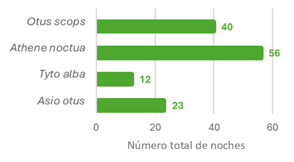{width="259"}
:::
::::

:::: column
::: card
El **mochuelo común** es el ave que ha cantado más número de noches.
:::
::::
:::::::

### **¿Cuántas veces por noche ha cantado cada especie?**

::::::: columns
:::: column
::: card-graficos
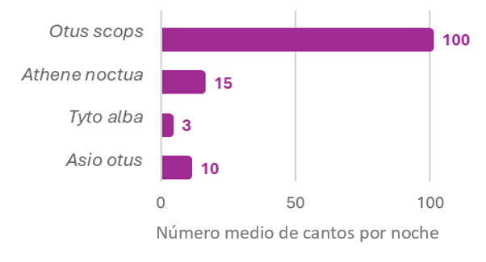{width="291"}
:::
::::

:::: column
::: card
El **autillo europeo** es el ave que más ha cantado cada noche, de media.
:::
::::
:::::::

### **¿Cuánto tiempo ha cantado en total cada especie?**

::::::: columns
:::: column
::: card-graficos
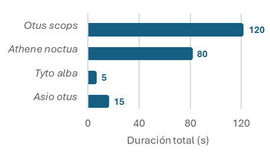{width="262"}
:::
::::

:::: column
::: card
El **autillo europeo** es la especie qué más actividad acústica ha tenido.
:::
::::
:::::::

## **Fenología - ¿Cuándo han cantado las aves nocturnas?**

### **Durante la temporada**

::::::: columns
:::: column
::: card-graficos
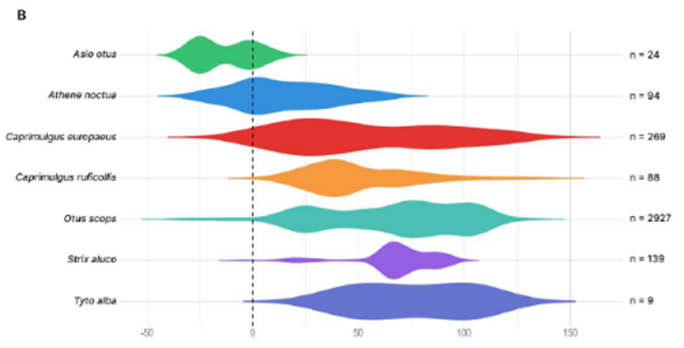{width="294"}

(gráfico de violín con densidad de vocalizaciones a lo largo de los meses)
:::
::::

:::: column
::: card
[Primera y última especie en vocalizar en la temporada]
:::
::::
:::::::

### **Durante la noche**

::::::: columns
:::: column
::: card-graficos
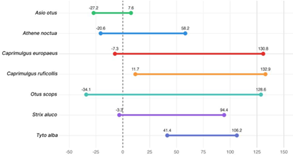

(gráfico: media del primer y último minuto respecto al atardecer en el que hay vocalizaciones de cada especie)
:::
::::

:::: column
::: card
De media, el **autillo europeo** es el ave que antes empieza a vocalizar en la noche, mientras que el **chotacabras cuellirrojo** es la última.
:::
::::
:::::::

## **Ejemplos de grabaciones**

### **Especies**

[fragmentos de audios de este punto, representativos de cada especie detectada o de algunas]

**Cárabo**

<audio controls>

<source src="audios/XC845803 - Cárabo común - Strix aluco.mp3" type="audio/mp3">

</audio>

```{r audio_especies, echo=FALSE, fig.width=12, fig.height=4}
library(tuneR)
library(seewave)

# Leer audio
audio <- readMP3("audios/XC845803 - Cárabo común - Strix aluco.mp3")
# Frecuencia de muestreo
fs <- audio@samp.rate

max_khz <- (fs/2000) * 0.99

par(family = "sans", bty = "n")
spectro(audio,
        f = fs,
        flim = c(0, 6),
        wl = 1024,
        ovlp = 75,
        scale = FALSE,
        osc = FALSE,
        palette = function(n) gray.colors(n, start = 1, end = 0),
        grid = FALSE,
        axisX = TRUE,
        axisY = TRUE,
        tcl = -0.2,
        cex.lab = 1,
        tlab = "Tiempo (s)",
        flab = "Frecuencia (kHz)")
```

### **Paisaje sonoro**

[grabaciones reproducibles en distintos momentos del muestreo, si se manda el informe en html]

(¿link a más audios de este punto? opción si se manda en pdf)

## **Más información**

Para ver los resultados globales del programa **NOCTUA con grabadoras** visita la web <a href="https://inesdiazg.github.io/noctua-mas/resultados" target="_blank">Noctua+</a>.

Para más información sobre el **programa NOCTUA** visita la <a href="https://seo.org/noctua-4/" target="_blank">web de SEO/BirdLife</a>.

#### Contacto:

{style="vertical-align: text-top; margin-right: 7px;" width="25"} [noctua\@seo.org](mailto:noctua@seo.org){.email}

{style="vertical-align: text-top; margin-right: 7px;" width="25"}91 434 09 10
